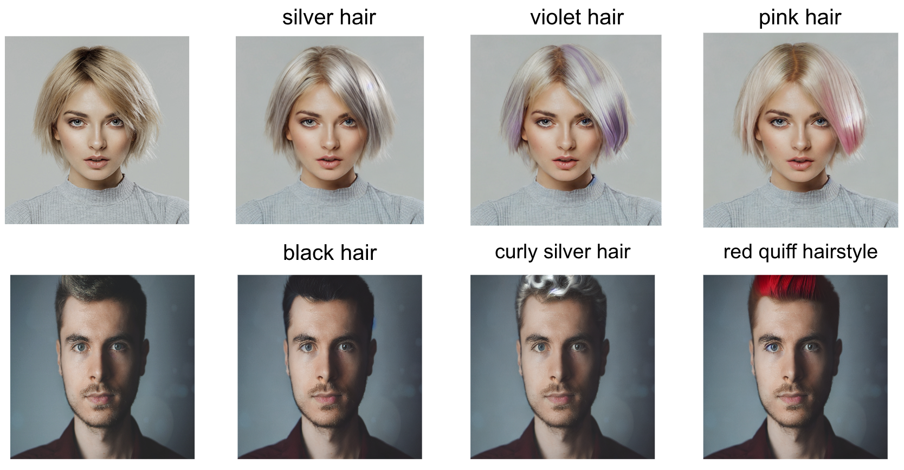

# Segment Anything + HumanEditing
In this branch, we plan to use [Segment Anything](https://github.com/facebookresearch/segment-anything) for human hair/face editing. Right now, we release the tiny demo for hair changing.

**Why this project?**
- [Segment Anything](https://github.com/facebookresearch/segment-anything) is a strong segmentation model. But it need prompts (like boxes/points) to generate masks. 
- Current Diffusion-based inpainting models support regional editing, we hope to utilize the segmentation model to generate detailed masks for inpainting.

## 🔥 What's New

**🆕 SAM + fashion-edit** [[Demo Notebook]](./fashion_edit.ipynb)
<center>
    
    <br>
    <div style="color:orange; border-bottom: 1px solid #d9d9d9;
    display: inline-block;
    color: #999;
    padding: 2px;">interactively mark part of interests, manipulation enpowered with inpainting model</div>
</center>
<br>

<center>
    
    <br>
    <div style="color:orange; border-bottom: 1px solid #d9d9d9;
    display: inline-block;
    color: #999;
    padding: 2px;">Simple notebook interactive annotation playground:<br> Left click to mark positive points[green dot] , right click for negative points[red dot] </div>
</center>

**SAM + hair-edit**




**Future interesting works**

Some possible avenues for future work ...
- Accurate face editing
- Change outfits, fashion style
- ...


## Catelog
- [x] Hair change jupyter-book Demo

## Installation
The code requires `python>=3.8`, as well as `pytorch>=1.7` and `torchvision>=0.8`. Please follow the instructions [here](https://pytorch.org/get-started/locally/) to install both PyTorch and TorchVision dependencies. Installing both PyTorch and TorchVision with CUDA support is strongly recommended.

Install Segment Anything:

```
pip install git+https://github.com/facebookresearch/segment-anything.git
```

or clone the repository locally and install with

```
git clone git@github.com:facebookresearch/segment-anything.git
cd segment-anything; pip install -e .
```

The following optional dependencies are necessary for mask post-processing, saving masks in COCO format, the example notebooks, and exporting the model in ONNX format. `jupyter` is also required to run the example notebooks.
```
pip install opencv-python pycocotools matplotlib onnxruntime onnx
```

Install FaceParsing Module:

We use [face-parsing.Pytorch](https://github.com/zllrunning/face-parsing.PyTorch) for preliminaril face parsing to detect the hair region. We already contain original code in this repo. You can download the [pre-trained model](https://drive.google.com/open?id=154JgKpzCPW82qINcVieuPH3fZ2e0P812) and save it in `face_parsing_PyTorch/res/cp`.

## Run Demo
- Download the checkpoint for SAM:

```bash
# We use the default(vit-h) model
wget https://dl.fbaipublicfiles.com/segment_anything/sam_vit_h_4b8939.pth
```

- Run demo<br>
[Hair edit - Jupyter Notebook](sam_hair.ipynb) <br>
[Fashion edit - Jupyter Notebook](fashion_edit.ipynb) <br>


## Acknowledgements
- [segment-anything](https://github.com/facebookresearch/segment-anything)
- [face-parsing.Pytorch](https://github.com/zllrunning/face-parsing.PyTorch)

## Citation
If you find this project helpful for your research, please consider citing the following BibTeX entry.
```BibTex
@article{kirillov2023segany,
  title={Segment Anything}, 
  author={Kirillov, Alexander and Mintun, Eric and Ravi, Nikhila and Mao, Hanzi and Rolland, Chloe and Gustafson, Laura and Xiao, Tete and Whitehead, Spencer and Berg, Alexander C. and Lo, Wan-Yen and Doll{\'a}r, Piotr and Girshick, Ross},
  journal={arXiv:2304.02643},
  year={2023}
}
```